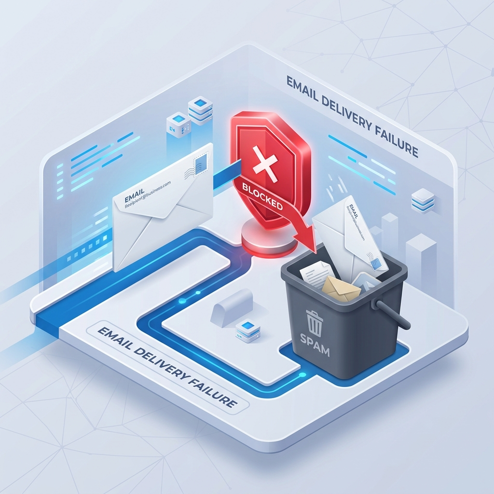
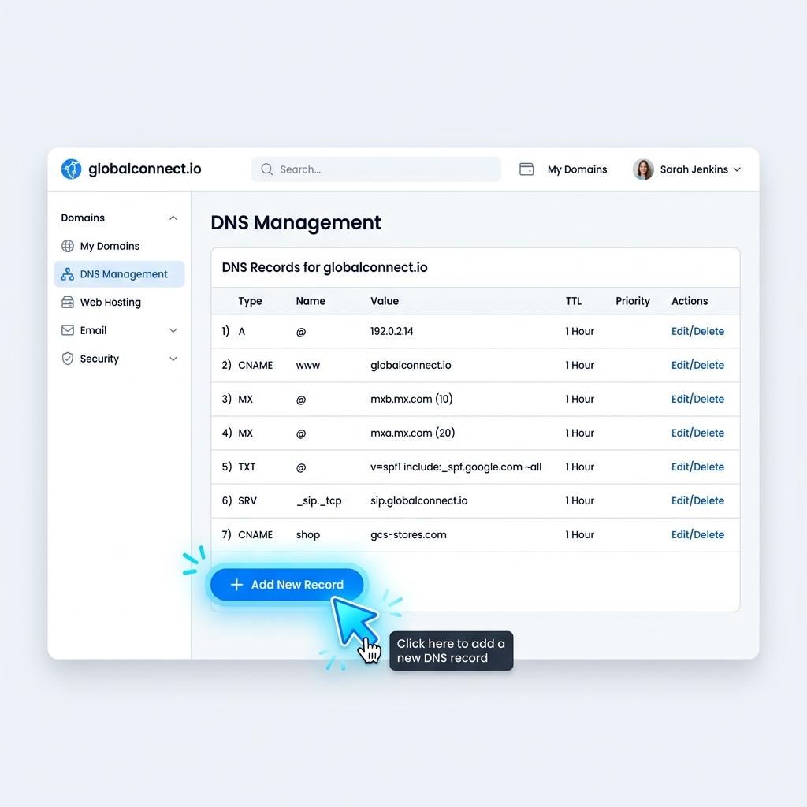

# Tutorial SURE: Cómo Recuperar tu Entregabilidad de Correos

Esta es la propuesta de flujo didáctico para educar al cliente final. Hemos generado ilustraciones 3D personalizadas para cada paso, reduciendo la ansiedad tecnológica y guiándolo de manera amigable.

## 1. El Problema (Por qué estás aquí)
**Mensaje al Cliente:** "Tus correos importantes están cayendo en Spam o siendo bloqueados por problemas de seguridad (Spoofing) en tu dominio."

---

## 2. Paso 1: Tomar la Captura de Pantalla
**Mensaje al Cliente:** "Abre tu cuenta de proveedor de dominio (GoDaddy, Namecheap, etc.) en la sección de DNS. No tienes que hacer nada técnico, solo presiona la tecla **Print Screen (PrtScn)** en tu teclado para tomarle una foto."

---

## 3. Paso 2: Pegar en el Portal VIP
**Mensaje al Cliente:** "Ve a nuestro Portal VIP de Soporte y simplemente presiona las teclas **Ctrl + V** al mismo tiempo. Nuestra plataforma recibirá tu imagen instantáneamente."

---

## 4. Paso 3: Agregando el Registro en tu Proveedor
**Mensaje al Cliente:** "Nuestra IA te entregará un código exacto. Solo tienes que ir a la sección de 'Gestión de DNS' en tu proveedor (como GoDaddy o Hostinger) y hacer clic en el botón de 'Agregar nuevo registro'. ¡Es así de simple!"

---

## 5. El Resultado: Correos Directo al Inbox
**Mensaje al Cliente:** "Sigue las instrucciones de la IA, repara tu dominio en minutos y vuelve a ver cómo tus correos aterrizan directo en la bandeja de entrada de tus clientes, protegiendo tus ventas."

