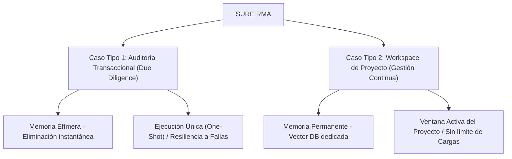

# INSTRUCTIVO OPERATIVO OFICIAL
## CICLO DE CONCILIACIÓN, MODALIDADES DE CASOS Y PROCESO DE SUBSANACIÓN DE ALERTAS
### Plataforma SURE RMA — Asistente de Mitigación de Riesgos Documentales

| Metadatos | Detalle |
| :--- | :--- |
| **Organización** | SURE Forensic (MB PROCDI) |
| **Documento** | Instructivo Particular del Ciclo de Conciliación y Subsanación de Alertas |
| **Código** | SURE-INS-GEN-002-REV1 |
| **Clasificación** | Documento Técnico y de Procesos / Aplicable a Clientes |
| **Versión** | Revisión 1 (Especialización de Modalidades) |
| **Autor** | Ecosistema SURE (Agente Consolidador) |

---

## 1. Propósito y Alcance

El presente instructivo describe el procedimiento operativo, la gobernanza multi-usuario, las reglas comerciales y las ventanas de tiempo aplicables al proceso de auditoría documental bajo demanda y subsanación de discrepancias en la plataforma **SURE RMA**.

Con la incorporación de nuevos casos de uso, la plataforma se divide en **dos modalidades operativas independientes** para responder de manera óptima tanto a transacciones puntuales de compra (*Due Diligence*) como a la gestión a largo plazo de contratos y suministros en obras civiles, infraestructura o servicios (*Workspace de Proyecto*).

---

## 2. Modalidades de Casos de Conciliación (Audit Cases)

SURE RMA estructura su servicio a través de "Casos". Un **Caso de Conciliación** es la unidad operativa y transaccional que agrupa la información de una contraparte o de un hito específico.



### 2.1 Caso Tipo 1: Auditoría Transaccional (Due Diligence / Compra Simple)
Diseñado para precalificar o evaluar de forma rápida a un proveedor o contraparte antes de realizar una transacción comercial única (compras simples, contratos específicos de commodities, etc.).
*   **Alcance:** Una sola contraparte o una única oferta de suministro.
*   **Retención de Datos:** **Memoria Efímera**. Por razones de confidencialidad estricta y cumplimiento comercial, todos los documentos y el buffer del caso se purgan de forma definitiva inmediatamente después de cerrar el caso o al expirar su vigencia.
*   **Gobernanza:** Sesión rápida de auditoría con usuarios limitados según el plan contratado.

### 2.2 Caso Tipo 2: Workspace de Proyecto (Administración y Conciliación de Proyectos)
Diseñado para la administración continuada de información documental durante el desarrollo de obras de infraestructura, construcción o contratos de servicios.
*   **Alcance:** Multidocumental y colaborativo. Permite cargar una **Información Base (Baseline)** del proyecto (pliegos de licitación, contrato inicial firmado, minutas de arranque, etc.) y posteriormente ir contrastando de forma continua los documentos del día a día (valuaciones mensuales de obra, diarios, reportes de calidad, adendas o versiones de contrato modificadas).
*   **Retención de Datos:** **Memoria Permanente**. Almacenamiento seguro en una base de datos vectorial privada y dedicada para el proyecto, permitiendo consultas contextuales históricas a los agentes.
*   **Gobernanza:** Workspace multi-usuario ilimitado con paneles compartidos, índices de avance y trazabilidad de acciones (*Audit Trail*).

---

## 3. Matriz Comparativa y Discriminación Comercial

Para asegurar un modelo justo y evitar el uso inadecuado de créditos únicos en análisis continuos, se establecen tarifas y límites diferenciados para cada modalidad:

| Característica / Parámetro | Caso Tipo 1: Auditoría Transaccional | Caso Tipo 2: Workspace de Proyecto |
| :--- | :--- | :--- |
| **Enfoque de Negocio** | Due Diligence / Compra Única | Gestión de Proyectos / Conciliación Continua |
| **Esquema de Memoria** | Efímera (Eliminada tras entrega del informe) | Permanente (Vector Database Privada dedicada) |
| **Tarifa Base** | Pago por Uso (Pay-as-you-go) | Suscripción Mensual Fija (Planes Tier 3 a Tier 6) |
| **Costo por Caso / Hito** | **USD 50.00** por Caso único (baja a USD 47.50 por volumen) | **Sin costo por uso** (Incluido en la tarifa mensual del Workspace) |
| **Ventana de Conciliación** | **Sin ventana interactiva** (Ejecución única / One-Shot) | **Duración del Proyecto** (Mientras la suscripción esté activa) |
| **Cargas de Subsanación** | **Sin Cargas Delta** (Permite reanudación por falla técnica antes de emitir el reporte) | **1 Carga Inicial + Cargas Delta ilimitadas** diarias |
| **Usuarios Autorizados** | 1 a 5 usuarios (según plan básico) | **Ilimitados** (Acceso compartido al Workspace del proyecto) |
| **Google Search Grounding** | Estándar (Verificación de entidades/sanciones) | Deep Grounding (Verificación exhaustiva en tiempo real) |

---

## 4. Plazos de Conciliación y Vigencia (Análisis de Tiempos)

> [!IMPORTANT]
> **Racional de Plazos:** Los límites de tiempo y carga están diseñados para proteger el modelo de negocio transaccional de SURE. Sin un límite en el Caso Tipo 1, un cliente podría usar una sola transacción de USD 50 para auditar secuencialmente a múltiples proveedores distintos a lo largo de un mes.

### 4.1 Ejecución Única y Resiliencia ante Fallas Técnicas (Caso Tipo 1)
*   **Modelo de Ejecución Única (One-Shot):** El Caso Tipo 1 es transaccional y directo. No dispone de una ventana de conciliación interactiva ni admite la carga de documentos de subsanación (Cargas Delta). El crédito de transacción (token) se consume de manera definitiva e irreversible al momento de procesarse el caso y emitirse el *Informe de Riesgo Transaccional*.
*   **Protocolo de Recuperación por Interrupción Técnica:** Para proteger al usuario de imprevistos que puedan interrumpir el flujo (caída de conexión a internet, falla de energía eléctrica, etc.), se establece la siguiente regla de negocio:
    1.  **Condición de Reanudación:** Mientras el *Informe de Riesgo Transaccional* **no haya sido generado**, la operación se considera "en curso" y el token permanece activo (disponible).
    2.  **Ruta de Acceso:** El cliente puede regresar al área de pago de la plataforma y seleccionar la opción **"Terminar operación pendiente"**.
    3.  **Identificación y Validación:** Al ingresar su correo electrónico, el sistema verificará el estado del pago y mostrará la información de **"Token disponible"**.
    4.  **Procesamiento:** El usuario podrá volver a cargar los documentos y procesar el caso para obtener el reporte final, consumiendo e inactivando el token en ese instante.

### 4.2 Ventana de Proyecto Activo para Caso Tipo 2 (Proyectos)
*   **¿Por qué aplica?** El desarrollo de un proyecto de infraestructura es continuo y toma meses o años. Los hitos (como las valuaciones de obra mensuales) se suceden de forma progresiva. 
*   La Ventana de Conciliación permanece **abierta e interactiva de forma permanente** mientras la suscripción al Workspace de Proyecto esté activa. No se imponen límites de días ni de cantidad de Cargas Delta rápidas para comparar borradores en el día a día. El proceso de **Cerrar y Emitir un Informe de Riesgo Transaccional Definitivo** (p. ej. al finalizar la conciliación mensual de un hito) es un evento puramente operativo de bloqueo y archivo documental que no genera ningún cargo adicional ni consumo de créditos, estando totalmente cubierto por la tarifa plana de la suscripción.

### 4.3 Control de Correspondencia y Protección de Evasión en Proyectos (Caso Tipo 2)
Dado que el Workspace de Proyecto (Caso Tipo 2) opera bajo una tarifa plana mensual con Cargas Delta ilimitadas, la plataforma aplica validaciones automáticas de coherencia con el Baseline para evitar abusos:
*   **Consistencia del Baseline:** Toda Carga Delta incremental debe referirse estrictamente al mismo alcance físico, contraparte, número de contrato o hito declarado en la Carga Inicial (Baseline).
*   **Bloqueo por Cambio de Alcance:** Si el motor de IA de SURE detecta que el lote documental corresponde a un proyecto u obra ajena a la configurada en el Workspace, la carga se bloqueará automáticamente. Esto evita la evasión de la suscripción de múltiples proyectos bajo una misma cuenta de Workspace.

---

## 5. Flujos de Trabajo Paso a Paso (Workflows)

### 5.1 Workflow del Caso Tipo 1: Auditoría Transaccional (Due Diligence)

```
[Pago de Caso (USD 50) / Token] ➔ [Acceso con Correo] ➔ [Carga de Documentos] ➔ [Análisis de Agentes (7 min)]
        ➔ [Emisión de Informe Definitivo Inmutable] ➔ [Consumo de Token & Purga de Memoria]
```

1.  **Pago y Obtención de Token:** El cliente realiza el pago de la transacción única (USD 50.00) y el sistema le asigna un token de auditoría asociado a su correo electrónico.
2.  **Carga de Documentos:** El usuario accede con su correo, visualiza su "Token disponible", y procede a cargar el lote de documentos base (contratos, fichas técnicas o cartas de crédito). 
    *   *Nota de Resiliencia:* Si ocurre una desconexión o fallo eléctrico antes del siguiente paso, el usuario regresa desde el área de pago ingresando su correo para continuar con el mismo token disponible.
3.  **Análisis y Procesamiento:** Al hacer clic en procesar, los agentes autónomos de SURE RMA realizan el cruce de información en un lapso estimado de 7 minutos.
4.  **Entrega y Purga:** La plataforma genera y muestra el *Informe de Riesgo Transaccional Definitivo* con firma digital SHA-256. En ese instante, el token de transacción se consume e inactiva de manera irreversible, y se **purgan permanentemente** todos los documentos y registros cargados de la memoria del servidor (Memoria Efímera).

### 5.2 Workflow del Caso Tipo 2: Workspace de Proyecto (Gestión Continua)

```
[Creación del Workspace del Proyecto (Suscripción)] ➔ [Carga del Baseline (Pliegos, Contrato original)]
        ➔ [Cargas Incrementales y Comparativas (Día a día, ilimitadas)]
        ➔ [Análisis Acumulativo de Desviaciones e Inconsistencias]
        ➔ [Cierre de Hito Mensual ➔ Emisión de Informe Definitivo (Sin costo extra)]
```

1.  **Establecimiento del Baseline:** Se carga el contrato original firmado, los pliegos de condiciones y las especificaciones técnicas base del proyecto. Esta información se vectoriza de forma permanente en la base de datos privada del Workspace.
2.  **Cargas Comparativas del Día a Día:** El equipo del proyecto carga borradores modificados, minutas de obra, o reportes semanales. El motor IA de SURE contrasta de manera acumulativa y contextual estos archivos contra la información base, reportando:
    *   Desviaciones en los materiales o especificaciones técnicas (ej. cambios no aprobados de marca en cables o zapatas).
    *   Asimetrías contractuales introducidas en borradores modificados (cambios sutiles en penalizaciones o plazos).
    *   Diferencias de precios o volúmenes no aprobados.
3.  **Conciliación y Emisión de Hitos:** Al cierre del mes o del hito, el supervisor del proyecto verifica que todas las alertas críticas estén resueltas en el dashboard y procesa el cierre del hito. Esto genera el *Informe de Riesgo Transaccional Definitivo del Hito* firmado digitalmente, bloqueando el expediente para su archivo histórico de auditoría sin ningún costo de transacción adicional ni consumo de créditos.

---

## 6. Clasificación de Alertas en la Bandeja Activa

SURE RMA segmenta las alertas detectadas de forma estructurada según la severidad del impacto comercial y fiduciario:

*   🔴 **Roja — Riesgo Alto (Discrepancias Críticas):** Afecta directamente la ruta crítica del proyecto, representa un riesgo de fraude directo o introduce una asimetría legal grave (ej. cambio en el banco emisor de una carta de crédito, discrepancias de precios unitarios o alteración maliciosa de cláusulas de penalización).
*   🟡 **Amarilla — Riesgo Medio (Cumplimiento y Soporte):** Omisión de documentos de soporte técnicos requeridos, falta de firmas de aprobación en minutas o certificados de calidad no verificables. Bloquea el avance contractual o la aprobación del pago parcial.
*   🔵 **Observación — Riesgo Bajo (Control Documental):** Desviaciones menores en la nomenclatura de archivos, saltos no registrados en el control de versiones de planos o discrepancias en formatos de reporte administrativo.

---

## 7. Gobernanza y Trazabilidad Multi-usuario

En proyectos medianos y grandes donde colaboran contratistas, ingenieros de control, asesores legales y financieros, SURE RMA garantiza la gobernanza mediante:

*   **Buscador Global de Reportes:** Permite acceder inmediatamente a la carpeta del caso usando el código del hito o reporte borrador para aportar evidencias correctivas.
*   **Audit Trail Transparente:** Registro inmutable de cada acción realizada (ej. *"Carlos Salazar cargó el archivo de pruebas de compactación de la zapata 4 y resolvió la alerta amarilla #12"*).
*   **Dashboard de Índices de Control:** Actualización automática y visual en tiempo real de los seis índices de control tras cada carga incremental:
    *   **IDR:** Índice de Desviación de Requisitos.
    *   **ITCS:** Índice de Trazabilidad y Cumplimiento de Suministros.
    *   **ICCR:** Índice de Cumplimiento Contractual y Regulatorio.
    *   **ICEC:** Índice de Coherencia Económico-Contractual.
    *   **IET:** Índice de Especificaciones Técnicas.
    *   **IIAB:** Índice de Integridad y Acreditación de Bancos y Terceros.

---

## 8. Sello de Integridad Digital y Validación de Agentes

SURE RMA sella cada reporte final mediante una huella criptográfica SHA-256 única, asegurando que el informe definitivo no pueda ser manipulado con posterioridad por ninguna de las partes.

🛡️ **SURE Verified Transactional Audit**
*Huella SHA-256 de Integridad:*
`a9b8c7d6e5f43210fedcba9876543210abcdef0123456789abcdef0123456789`

**Firmas de Conformidad de los Agentes Autónomos:**
*   **Roberto** (Due Diligence Agent) — *Mapeo legal, compliance corporativo y listas internacionales.*
*   **Moisés** (Legal & Contracts Agent) — *Análisis contractual, mitigación de asimetrías y validación bancaria.*
*   **Alcides** (Technical Specs Agent) — *Auditoría fisicoquímica, hojas de seguridad, estándares de ingeniería y especificaciones de material.*
*   **El Notario** (Executive Notary / Agente Consolidador) — *Verificación de consistencia cruzada y firma del sello de validez.*
