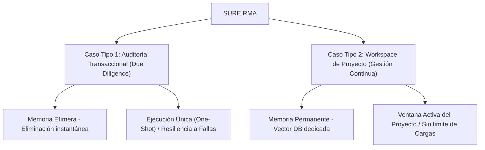

# INSTRUCTIVO OPERATIVO OFICIAL
## CICLO DE CONCILIACIÓN, MODALIDADES DE CASOS Y PROCESO DE SUBSANACIÓN DE ALERTAS
### Plataforma SURE RMA — Asistente de Mitigación de Riesgos Documentales

| Metadatos | Detalle |
| :--- | :--- |
| **Organización** | SURE Forensic (MB PROCDI) |
| **Documento** | Instructivo Particular del Ciclo de Conciliación y Subsanación de Alertas |
| **Código** | SURE-INS-GEN-002-REV1 |
| **Clasificación** | Documento Técnico y de Procesos / Aplicable a Clientes |
| **Versión** | Revisión 1 (Especialización de Modalidades) |
| **Autor** | Ecosistema SURE (Agente Consolidador) |

---

## 1. Propósito y Alcance

El presente instructivo describe el procedimiento operativo, la gobernanza multi-usuario, las reglas comerciales y las ventanas de tiempo aplicables al proceso de auditoría documental bajo demanda y subsanación de discrepancias en la plataforma **SURE RMA**.

Con la incorporación de nuevos casos de uso, la plataforma se divide en **dos modalidades operativas independientes** para responder de manera óptima tanto a transacciones puntuales de compra (*Due Diligence*) como a la gestión a largo plazo de contratos y suministros en obras civiles, infraestructura o servicios (*Workspace de Proyecto*).

---

## 2. Modalidades de Casos de Conciliación (Audit Cases)

SURE RMA estructura su servicio a través de "Casos". Un **Caso de Conciliación** es la unidad operativa y transaccional que agrupa la información de una contraparte o de un hito específico.



### 2.1 Caso Tipo 1: Auditoría Transaccional (Due Diligence / Compra Simple)
Diseñado para precalificar o evaluar de forma rápida a un proveedor o contraparte antes de realizar una transacción comercial única (compras simples, contratos específicos de commodities, etc.).
*   **Alcance:** Una sola contraparte o una única oferta de suministro.
*   **Retención de Datos:** **Memoria Efímera**. Por razones de confidencialidad estricta y cumplimiento comercial, todos los documentos y el buffer del caso se purgan de forma definitiva inmediatamente después de cerrar el caso o al expirar su vigencia.
*   **Gobernanza:** Sesión rápida de auditoría con usuarios limitados según el plan contratado.

### 2.2 Caso Tipo 2: Workspace de Proyecto (Administración y Conciliación de Proyectos)
Diseñado para la administración continuada de información documental durante el desarrollo de obras de infraestructura, construcción o contratos de servicios.
*   **Alcance:** Multi-caso y colaborativo. Permite cargar una **Información Base (Baseline)** del proyecto (pliegos de licitación, contrato inicial firmado, especificaciones técnicas, etc.) y gestionar de forma independiente múltiples Casos de Conciliación a lo largo de la vida del proyecto (ej. auditoría de ofertas de subcontratistas, revisión de especificaciones, variaciones de diseño o diarios de obra).
*   **Retención de Datos:** **Memoria Permanente (Reporte Residente)**. Toda la información analizada, los borradores, los logs y los reportes finales emitidos quedan almacenados de forma permanente y segura en la base de datos del Workspace del proyecto para auditoría histórica, manteniéndose residentes para consulta de los agentes.
*   **Gobernanza:** Panel de control de Casos interactivo que lista cada caso con su código, descripción, usuario ejecutor, logs de auditoría y estatus (Pendiente / Finalizado). Permite abrir y dejar Casos inconclusos para atender otras prioridades, reanudándolos cuando se disponga de la información.

---

## 3. Matriz Comparativa y Discriminación Comercial

Para asegurar un modelo justo y evitar el uso inadecuado de créditos únicos en análisis continuos, se establecen tarifas y límites diferenciados para cada modalidad:

| Característica / Parámetro | Caso Tipo 1: Auditoría Transaccional | Caso Tipo 2: Workspace de Proyecto |
| :--- | :--- | :--- |
| **Enfoque de Negocio** | Due Diligence / Compra Única | Gestión de Proyectos / Conciliación Continua |
| **Esquema de Memoria** | Efímera (Eliminada tras entrega del informe) | Permanente (Reporte Residente en Vector DB del proyecto) |
| **Tarifa Base** | Pago por Uso (Pay-as-you-go) | Suscripción Mensual Fija (Planes Tier 3 a Tier 6) |
| **Costo por Caso / Hito** | **USD 50.00** por Caso único (baja a USD 47.50 por volumen) | **Sin costo por uso** (Incluido en la tarifa mensual del Workspace) |
| **Ventana de Conciliación** | **Sin ventana interactiva** (Ejecución única / One-Shot) | **Duración del Proyecto** (Mientras la suscripción esté activa) |
| **Cargas de Subsanación** | **Sin Cargas Delta** (Permite reanudación por falla técnica antes de emitir el reporte) | **Carga Inicial + Cargas Delta ilimitadas** por Caso |
| **Usuarios Autorizados** | 1 a 5 usuarios (según plan básico) | **Ilimitados** (Acceso compartido al Workspace del proyecto) |
| **Google Search Grounding** | Estándar (Verificación de entidades/sanciones) | Deep Grounding (Verificación exhaustiva en tiempo real) |

---

## 4. Plazos de Conciliación y Vigencia (Análisis de Tiempos)

> [!IMPORTANT]
> **Política de Retención y Purgado de Datos:** Por motivos de seguridad de la información, confidencialidad estricta y protección de datos comerciales, el Caso Tipo 1 (Auditoría Transaccional) utiliza memoria efímera. La sesión y el acceso a los archivos auditados se mantendrán activos únicamente durante **1 minuto** después de haberse generado y descargado el *Informe de Riesgo Transaccional*, procediendo inmediatamente al borrado automático e irreversible en nuestros servidores.

### 4.1 Ejecución Única y Resiliencia ante Fallas Técnicas (Caso Tipo 1)
*   **Modelo de Ejecución Única (One-Shot):** El Caso Tipo 1 es transaccional y directo. No dispone de una ventana de conciliación interactiva ni admite la carga de documentos de subsanación (Cargas Delta). El crédito de transacción (token) se consume de manera definitiva e irreversible al momento de procesarse el caso y emitirse el *Informe de Riesgo Transaccional*.
*   **Protocolo de Recuperación por Interrupción Técnica:** Para proteger al usuario de imprevistos que puedan interrumpir el flujo (caída de conexión a internet, falla de energía eléctrica, etc.), se establece la siguiente regla de negocio:
    1.  **Condición de Reanudación:** Mientras el *Informe de Riesgo Transaccional* **no haya sido generado**, la operación se considera "en curso" y el token permanece activo (disponible).
    2.  **Ruta de Acceso:** El cliente puede regresar al área de pago de la plataforma y seleccionar la opción **"Terminar operación pendiente"**.
    3.  **Identificación y Validación:** Al ingresar su correo electrónico, el sistema verificará el estado del pago y mostrará la información de **"Token disponible"**.
    4.  **Procesamiento:** El usuario podrá volver a cargar los documentos y procesar el caso para obtener el reporte final, consumiendo e inactivando el token en ese instante.

### 4.2 Ventana de Proyecto Activo y Gestión Flexible (Caso Tipo 2)
*   **¿Por qué aplica?** La gestión de una obra de infraestructura requiere flexibilidad. Los casos y auditorías se abren bajo demanda (ej. evaluar una propuesta de subcontratista o certificar un lote de materiales).
*   **Operación Flexible de Casos:** La Ventana de Conciliación permanece abierta de manera indefinida mientras la suscripción esté activa. El usuario puede abrir múltiples Casos en paralelo, dejar un Caso inconcluso (marcado como "Pendiente") para iniciar otro prioritario, y reanudarlo posteriormente cuando cuente con la información requerida.
*   **Reporte Residente:** Al terminar la conciliación de un Caso, el usuario procesa su cierre. Esto genera un *Informe de Riesgo Transaccional Definitivo del Caso* que se archiva y queda residente de manera permanente en la base de datos del proyecto para fines de auditoría, sin costo adicional ni consumo de créditos.

### 4.3 Protección de Suscripción mediante Bloqueo de Identidad del Proyecto (Baseline Lock)
Para evitar que un cliente evada la suscripción individual por proyecto y utilice un solo Workspace para múltiples obras diferentes (ej. desactivando o inhabilitando documentos del Proyecto 1 para procesar el Proyecto 2):
*   **Baseline Lock (Bloqueo de Metadatos):** Durante la inicialización del Workspace, el cliente debe definir los metadatos de identidad del proyecto (Nombre oficial de la obra, Número de Contrato Principal, Nombre del Comitente y Ubicación). Estos datos son **inmutables** y de solo lectura.
*   **Filtro Algorítmico de Consistencia:** Toda Carga Inicial o Delta en cualquier Caso procesado dentro de ese Workspace se valida algorítmicamente contra este Baseline Lock. Si el motor de IA de SURE detecta que los documentos subidos pertenecen a un contrato, obra o comitente diferente, la carga se bloquea automáticamente y el sistema exige la apertura de un nuevo Workspace con su respectiva suscripción.

---

## 5. Flujos de Trabajo Paso a Paso (Workflows)

### 5.1 Workflow del Caso Tipo 1: Auditoría Transaccional (Due Diligence)

```
[Pago de Caso (USD 50) / Token] ➔ [Acceso con Correo] ➔ [Carga de Documentos] ➔ [Análisis de Agentes (7 min)]
        ➔ [Emisión de Informe Definitivo Inmutable] ➔ [Consumo de Token & Purga de Memoria]
```

1.  **Pago y Obtención de Token:** El cliente realiza el pago de la transacción única (USD 50.00) y el sistema le asigna un token de auditoría asociado a su correo electrónico.
2.  **Carga de Documentos:** El usuario accede con su correo, visualiza su "Token disponible", y procede a cargar el lote de documentos base (contratos, fichas técnicas o cartas de crédito). 
    *   *Nota de Resiliencia:* Si ocurre una desconexión o fallo eléctrico antes del siguiente paso, el usuario regresa desde el área de pago ingresando su correo para continuar con el mismo token disponible.
3.  **Análisis y Procesamiento:** Al hacer clic en procesar, los agentes autónomos de SURE RMA realizan el cruce de información en un lapso estimado de 7 minutos.
4.  **Entrega y Purga:** La plataforma genera y muestra el *Informe de Riesgo Transaccional Definitivo* con firma digital SHA-256. En ese instante, el token de transacción se consume e inactiva de manera irreversible. El usuario dispone de **1 minuto** para descargar o guardar el reporte antes de que el sistema **purgue permanentemente** todos los documentos y registros del servidor por motivos de privacidad (Memoria Efímera).

### 5.2 Workflow del Caso Tipo 2: Workspace de Proyecto (Gestión Continua)

```
[Creación del Workspace / Configuración de Identidad] ➔ [Carga del Baseline Lock (Pliegos, Contrato)]
        ➔ [Gestión Multicaso: Apertura, Pausa o Cierre de Casos]
        ➔ [Generación de Informes por Caso (Reporte Residente)]
        ➔ [Reporte Analítico Mensual / Consolidación de Estado del Proyecto]
```

1.  **Establecimiento de Identidad y Baseline:** Se configuran los datos fijos del proyecto y se carga el contrato principal, pliegos y especificaciones base. Esta información se bloquea (*Baseline Lock*) y se vectoriza de forma permanente en la base de datos del Workspace.
2.  **Gestión de Casos Independientes:** El equipo abre Casos específicos bajo demanda (ej. "Revisión de Oferta del Subcontratista A", "Ensayo de compactación de zapatas"). Cada Caso se analiza y puede dejarse pendiente, retomarse o cerrarse de forma del proyecto. El motor de SURE contrasta los documentos del Caso contra el Baseline inmutable.
3.  **Cierre del Caso y Reporte Residente:** Al verificar la conformidad de las alertas, el usuario finaliza el caso. El sistema genera el *Informe de Riesgo Transaccional Definitivo del Caso* firmado con la huella digital SHA-256, guardándose en la base de datos del Workspace de forma permanente (residente) sin costo transaccional.
4.  **Generación de Reporte Analítico Mensual:** Al no operar 100% en línea de forma intrusiva, la plataforma permite al supervisor generar reportes consolidados en cualquier momento (ej. mensualmente), mostrando las estadísticas de Casos resueltos, Casos pendientes, alertas activas e históricos del proyecto.

---

## 6. Clasificación de Alertas en la Bandeja Activa

SURE RMA segmenta las alertas detectadas de forma estructurada según la severidad del impacto comercial y fiduciario:

*   🔴 **Roja — Riesgo Alto (Discrepancias Críticas):** Afecta directamente la ruta crítica del proyecto, representa un riesgo de fraude directo o introduce una asimetría legal grave (ej. cambio en el banco emisor de una carta de crédito, discrepancias de precios unitarios o alteración maliciosa de cláusulas de penalización).
*   🟡 **Amarilla — Riesgo Medio (Cumplimiento y Soporte):** Omisión de documentos de soporte técnicos requeridos, falta de firmas de aprobación en minutas o certificados de calidad no verificables. Bloquea el avance contractual o la aprobación del pago parcial.
*   🔵 **Observación — Riesgo Bajo (Control Documental):** Desviaciones menores en la nomenclatura de archivos, saltos no registrados en el control de versiones de planos o discrepancias en formatos de reporte administrativo.

---

## 7. Gobernanza y Trazabilidad Multi-usuario

En proyectos medianos y grandes donde colaboran contratistas, ingenieros de control, asesores legales y financieros, SURE RMA garantiza la gobernanza mediante:

*   **Panel de Casos del Workspace:** Un tablero central que lista de forma clara y organizada cada uno de los casos procesados o en curso en el proyecto. La tabla de control incluye:
    *   `Número de Referencia` del Caso (ej. `SURE-CASE-2026-104`).
    *   `Descripción / Asunto` (ej. *"Revisión de planos de cimentación - Adenda 2"*).
    *   `Usuario` que inició o actualizó el caso.
    *   `Estatus` del Caso (Pendiente / Finalizado).
    *   `Fecha de Creación / Actualización`.
    *   `Logs de Auditoría y Detalles` (Enlace al historial de archivos y alertas).
*   **Buscador Global de Reportes:** Permite acceder inmediatamente a la carpeta de cualquier Caso usando su código de referencia para revisar el borrador o ingresar información.
*   **Audit Trail Transparente:** Registro inmutable de cada acción realizada en la plataforma (ej. *"Carlos Salazar finalizó el Caso SURE-CASE-2026-104 y emitió el reporte definitivo"*).
*   **Dashboard de Índices de Control:** Actualización automática y visual de los seis índices de control consolidados del proyecto en función de los casos finalizados:
    *   **IDR:** Índice de Desviación de Requisitos.
    *   **ITCS:** Índice de Trazabilidad y Cumplimiento de Suministros.
    *   **ICCR:** Índice de Cumplimiento Contractual y Regulatorio.
    *   **ICEC:** Índice de Coherencia Económico-Contractual.
    *   **IET:** Índice de Especificaciones Técnicas.
    *   **IIAB:** Índice de Integridad y Acreditación de Bancos y Terceros.

---

## 8. Sello de Integridad Digital y Validación de Agentes

SURE RMA sella cada reporte final mediante una huella criptográfica SHA-256 única, asegurando que el informe definitivo no pueda ser manipulado con posterioridad por ninguna de las partes.

🛡️ **SURE Verified Transactional Audit**
*Huella SHA-256 de Integridad:*
`a9b8c7d6e5f43210fedcba9876543210abcdef0123456789abcdef0123456789`

**Firmas de Conformidad de los Agentes Autónomos:**
*   **Roberto** (Due Diligence Agent) — *Mapeo legal, compliance corporativo y listas internacionales.*
*   **Moisés** (Legal & Contracts Agent) — *Análisis contractual, mitigación de asimetrías y validación bancaria.*
*   **Alcides** (Technical Specs Agent) — *Auditoría fisicoquímica, hojas de seguridad, estándares de ingeniería y especificaciones de material.*
*   **El Notario** (Executive Notary / Agente Consolidador) — *Verificación de consistencia cruzada y firma del sello de validez.*
