# INFORME DE EVALUACIÓN TÉCNICA DE OFERTAS (LICITACIÓN STATCOM ±600 MVAR)

---

## 1. INTRODUCCIÓN Y ANTECEDENTES
Este informe presenta la evaluación técnico-económica detallada de la oferta presentada por la empresa **Suradem** para el suministro e instalación bajo modalidad llave en mano de un sistema STATCOM de ±600 MVAR conectado a 765 kV. La evaluación se realiza contrastando la propuesta contra las bases de la Especificación Técnica SURE-TS-STATCOM-001.

---

## 2. IDENTIFICACIÓN Y CLASIFICACIÓN DE DESVIACIONES

| Ref | Aspecto Evaluado | Detalle de la Desviación / Omisión de Suradem | Clasificación de Criticidad | Impacto Técnico / Operativo / Económico |
| :--- | :--- | :--- | :--- | :--- |
| **D-01** | **Sistema de Refrigeración** | Omisión completa del desglose técnico-económico de la opción de refrigeración por aire forzado. Solo cotiza agua desionizada. | **Menor** | Técnico-económico moderado. Aunque la refrigeración por agua es la más óptima para 45 °C, la omisión impide la comparación obligada por el pliego. |
| **D-02** | **Monitoreo en Línea del Transformador** | Ofrece DGA básico de 3 gases en lugar del de 9 gases. Omite completamente el monitoreo continuo de bushings. | **Mayor** | Alto impacto operativo. Los bushings a 765 kV son puntos críticos de falla catastrófica. La falta de DGA completo y monitoreo de bushings eleva el riesgo de incidentes. |
| **D-03** | **Sincronización de Tiempo y Red** | Sin redundancia de receptor GPS y sin soporte de PTP (IEEE 1588). Solo ofrece IRIG-B. | **Mayor** | Impacto en la integración. Limita la precisión del registro de oscilografía y la interoperabilidad de las Merging Units en el bus de proceso. |
| **D-04** | **Comunicaciones Satelitales** | Starlink Business está configurado fijo como canal principal, en vez de respaldo automático con conmutación inteligente SD-WAN. | **Mayor** | Operativo. Contradecir la jerarquía de canales de comunicación expone el tráfico de control en tiempo real a enlaces satelitales públicos sin respaldo físico dedicado. |
| **D-05** | **Estudios de Ingeniería** | Omisión del estudio RAMS en la propuesta y subcontratación diferida de los estudios EMT en PSCAD/EMTDC. | **Crítica** | Alto riesgo de diseño. Los estudios EMT son obligatorios en la fase de ingeniería básica para verificar sobretensiones críticas a 765 kV. Su postergación puede acarrear retrasos en la fabricación del transformador. |
| **D-06** | **Disponibilidad y Mantenimiento** | MTTR propuesto de 6 horas en lugar de las 4 horas máximas requeridas. | **Menor** | Penalizaciones por indisponibilidad a largo plazo para el operador nacional. |
| **D-07** | **Repuestos** | Omisión de la lista de repuestos requerida para los primeros 2 años. | **Menor** | Riesgo de stock de seguridad al inicio de la operación comercial. |
| **D-08** | **Financiamiento** | Ofrece Vendor Financing a SOFR + 3.8% sin carta de interés de Agencia de Crédito a la Exportación (ECA). | **Mayor** | Económico. Incrementa el costo de capital en comparación con los esquemas preferenciales ECA. |

---

## 3. MATRIZ DE EVALUACIÓN MULTICRITERIO PONDERADA

La evaluación técnica se ha estructurado conforme a cinco pilares de ponderación con un puntaje máximo de 100 puntos. La calificación mínima aprobatoria es de **80 puntos**.

```mermaid
gantt
    title Puntuación Técnica Obtenida por Suradem (Total: 68/100)
    dateFormat  X
    axisFormat %s
    section Cumplimiento de Potencia (Max 25)
    Obtenido           :active, 0, 22
    section Arquitectura de Control y Red (Max 20)
    Obtenido           : 0, 12
    section Confiabilidad y Estudios (Max 20)
    Obtenido           : 0, 10
    section Equipos de Patio y Transfo (Max 20)
    Obtenido           : 0, 14
    section Plan de Ejecución y O&M (Max 15)
    Obtenido           : 0, 10
```

### Tabla de Calificación Ponderada:
| Criterio de Evaluación | Peso (%) | Puntuación Suradem | Puntuación Ponderada | Comentarios / Justificación de la Nota |
| :--- | :--- | :--- | :--- | :--- |
| **Cumplimiento de Potencia y VSC** | 25% | 88/100 | 22.0 / 25.0 | Cumple con la potencia de ±600 MVAR, pero la respuesta dinámica es de 12 ms (el pliego pedía <10 ms). |
| **Arquitectura de Control, Red y Comm** | 20% | 60/100 | 12.0 / 20.0 | Penalizado por falta de redundancia GPS, omisión de PTP y forzar Starlink como canal principal. |
| **Confiabilidad, RAMS y Estudios EMT** | 20% | 50/100 | 10.0 / 20.0 | Penalizado por omitir el estudio RAMS y postergar los estudios EMT en PSCAD/EMTDC. |
| **Equipos de Patio y Transformador** | 20% | 70/100 | 14.0 / 20.0 | Afectado por omisión de monitoreo de bushings en el transformador de 765 kV y DGA de solo 3 gases. |
| **Plan de Ejecución, Repuestos y O&M**| 15% | 66/100 | 10.0 / 15.0 | Afectado por MTTR de 6h y omisión de repuestos para los primeros 2 años de operación. |
| **CALIFICACIÓN TÉCNICA TOTAL** | **100%** | **68.0 / 100.0** | **NO APROBADO (Mínimo: 80.0)** | La oferta técnica actual de Suradem es **Técnicamente No Conforme**. |

---

## 4. IMPACTO OPERATIVO Y RIESGOS ASOCIADOS

### 4.1. Riesgos de Ingeniería y Fabricación (Estudios EMT)
Postergar los estudios EMT en PSCAD/EMTDC y la coordinación de aislamiento a la fase posterior a la firma del contrato es un riesgo crítico. La impedancia transitoria de la red de 765 kV y los fenómenos de resonancia armónica podrían exigir cambios de diseño en el devanado de 45 kV del transformador o en la inductancia de los reactores de acoplamiento del STATCOM. Si los equipos ya se encuentran en fase de fabricación, esto generaría **órdenes de cambio de alto costo económico y retrasos de varios meses**.

### 4.2. Riesgos de Falla Catastrófica (Transformador 765 kV)
La red nacional de 765 kV experimenta un nivel isoceráunico severo. Los bushings del transformador elevador están sometidos a elevados transitorios de tensión por descargas atmosféricas. **Omitir el monitoreo continuo de bushings impide predecir fallas dieléctricas**, incrementando la probabilidad de fallas catastróficas del transformador principal de la subestación.

---

## 5. RECOMENDACIÓN TÉCNICA FINAL
Debido a las desviaciones identificadas, especialmente la desviación crítica **D-05 (postergación de estudios EMT y falta de RAMS)** y la desviación mayor **D-02 (falta de monitoreo de bushings en el transformador de 765 kV)**, la propuesta de Suradem no puede ser adjudicada de forma directa.

### Plan de Acción Recomendado:
1.  **Emitir Pliego de Aclaraciones Técnicas (Clarification Round):** Solicitar formalmente a Suradem subsanar las desviaciones críticas en un plazo no mayor a 10 días hábiles.
2.  **Condición de Aceptabilidad de Oferta:**
    *   Exigir la inclusión de los estudios EMT en el alcance base de ingeniería inicial sin costo adicional.
    *   Exigir la incorporación del sistema de monitoreo en línea de bushings y DGA de 9 gases en el transformador elevador.
    *   Exigir el soporte de sincronización de tiempo PTP redundante.
3.  **Evaluación de Respuestas:** Si Suradem se niega a subsanar los puntos D-02 y D-05 sin incremento en el precio EPC cotizado de USD 78.5M, se recomienda la descalificación de la oferta y la apertura de negociaciones con el segundo postor de la licitación.
