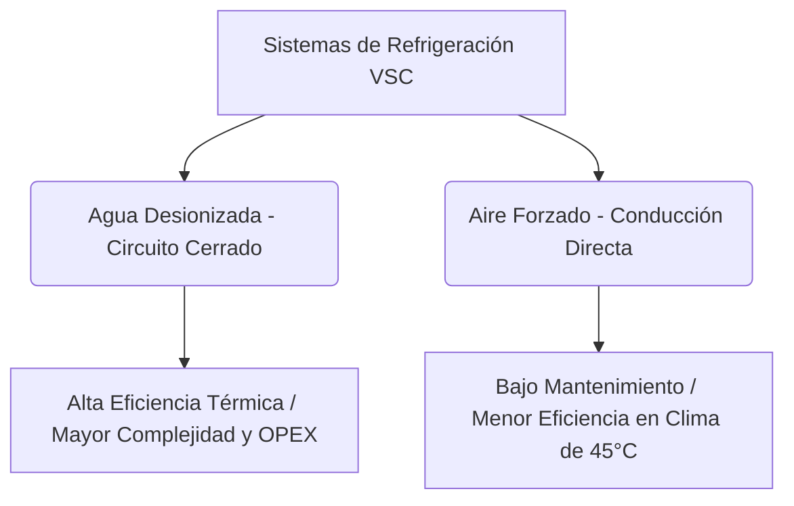

# ESPECIFICACIÓN TÉCNICA INTERNACIONAL: SISTEMA STATCOM DE ±600 MVAR PARA 765 kV

---

## 1. CONTROL DE DOCUMENTO Y APROBACIONES
*   **Código de Documento:** SURE-TS-STATCOM-001
*   **Revisión:** 0
*   **Fase:** Licitación EPC Internacional
*   **Preparado por:** Principal Lead Engineer - EPC Transmission division

---

## 2. INTRODUCCIÓN Y ALCANCE GENERAL

### 2.1. Objetivo del Documento
Esta Especificación Técnica establece los requisitos mínimos para el diseño, ingeniería, fabricación, pruebas en fábrica (FAT), embalaje, transporte, obras civiles, montaje electromecánico, pruebas en sitio (SAT), comisionamiento y puesta en servicio de un sistema de Compensación Estática Síncrona (STATCOM) de **±600 MVAR** conectado a la barra de **45 kV** y elevado a **765 kV** para su inyección al Sistema de Transmisión Nacional.

### 2.2. Modalidad de Contrato
El proyecto se ejecutará bajo la modalidad **Llave en Mano (Turnkey EPC)**. El Contratista será el único responsable de la entrega de una instalación completa, segura, funcional y optimizada.

### 2.3. Límites de Batería
*   **Lado de Alta Tensión (HV):** Bornes de salida del pórtico de la línea de 765 kV.
*   **Lado de Baja Tensión (LV) / Servicios Auxiliares:** Conexión a la red de distribución local para respaldo de servicios auxiliares.
*   **Comunicaciones:** Puerto físico en el switch de frontera para integración con el Despacho Nacional de Carga (DNC).

---

## 3. NORMAS Y CÓDIGOS DE REFERENCIA
Todos los equipos e ingeniería deberán cumplir con las últimas revisiones de las siguientes normas internacionales:
*   **IEC 62927:** Voltage source converter (VSC) valves for static synchronous compensators (STATCOM).
*   **IEEE 1052:** IEEE Guide for Specification of Static Var Compensators (SVC) and STATCOM.
*   **IEC 61850:** Communication networks and systems for power utility automation.
*   **IEEE 519:** Recommended Practice and Requirements for Harmonic Control in Electric Power Systems.
*   **IEC 60076:** Power transformers (partes 1 a 24).
*   **IEC 62271:** High-voltage switchgear and controlgear.
*   **CIGRE TB 666 / TB 741:** FACTS reliability and STATCOM performance specifications.

---

## 4. CONDICIONES AMBIENTALES DE DISEÑO
Los equipos e instalaciones deberán diseñarse para operar continuamente bajo las siguientes condiciones del sitio:
*   **Temperatura Ambiente Operativa:** 28 °C (mínima) a 45 °C (máxima).
*   **Humedad Relativa:** Hasta 95% (ambiente altamente corrosivo y condensante).
*   **Pluviosidad:** Alta pluviosidad estacional.
*   **Nivel Isoceráunico:** Elevado (densidad de rayos a tierra $> 8$ descargas/km²/año).
*   **Radiación Solar Máxima:** $1.100\text{ W/m}^2$.
*   **Ciclo de Operación:** 24 horas al día, 365 días al año.
*   **Vida Útil de Diseño:** Mínimo 30 años.

---

## 5. CARACTERÍSTICAS TÉCNICAS PRINCIPALES DEL SISTEMA

### 5.1. Tecnología Convertidora
*   **Configuración:** Convertidor de Fuente de Tensión (VSC) Multinivel Modular (MMC).
*   **Semiconductores:** IGBTs (Insulated Gate Bipolar Transistor) de alta velocidad de conmutación y bajas pérdidas, con diodo antiparalelo integrado.
*   **Control Vectorial Digital:** Control independiente de potencia activa y reactiva desacoplado por coordenadas d-q directas.

### 5.2. Parámetros Eléctricos Nominados
| Parámetro | Valor Requerido |
| :--- | :--- |
| **Capacidad Continua Dinámica** | $\pm 600\text{ MVAR}$ en bornes de 765 kV |
| **Tiempo de Respuesta Dinámica** | $< 10\text{ ms}$ (paso de reactivo completo) |
| **Tensión Nominal de Barra STATCOM** | $45\text{ kV}$ |
| **Tensión Nominal de Red Nacional** | $765\text{ kV}$ (rango operativo: $700\text{ kV} - 800\text{ kV}$) |
| **Frecuencia Nominal** | $50\text{ Hz} / 60\text{ Hz}$ |
| **Pérdidas Máximas Garantizadas** | $\le 0.8\%$ de la potencia aparente nominal |

### 5.3. Funcionalidades de Control Requeridas
1.  **Regulación Automática de Tensión (AVR):** Control de bucle cerrado con estatismo programable ($0-10\%$).
2.  **Amortiguamiento de Oscilaciones de Potencia (POD):** Algoritmo dinámico para estabilizar oscilaciones electromecánicas ($0.1\text{ Hz} - 2.0\text{ Hz}$).
3.  **Mitigación de Flicker y Armónicos:** Compensación selectiva activa hasta el orden armónico 49º.
4.  **Soporte de Tensión en Falla (FRT - Fault Ride Through):** Capacidad de inyectar corriente de falla capacitiva o inductiva de alta velocidad durante huecos de tensión del sistema.

---

## 6. COMPARATIVA TÉCNICA DE LOS SISTEMAS DE REFRIGERACIÓN
El Oferente deberá presentar obligatoriamente las dos alternativas de refrigeración para las válvulas de IGBT.

### Tabla Comparativa Técnico-Económica Requerida:
| Criterio | Agua Desionizada (Cerrado) | Aire Forzado |
| :--- | :--- | :--- |
| **Eficiencia Térmica** | Excelente (Permite IGBTs de mayor densidad). | Moderada (Requiere sobredimensionar IGBTs). |
| **Consumo de Energía** | Bajo (Solo bombas de agua y ventiladores secos). | Alto (Ventiladores axiales de gran caudal continuo). |
| **Disponibilidad** | $> 99.8\%$ (Con bombas redundantes). | $> 99.5\%$ (Falla de ventilador reduce capacidad). |
| **Mantenimiento** | Alto (Monitoreo de conductividad, filtros, resinas). | Muy Bajo (Limpieza física de filtros de aire). |
| **MTBF** | $60.000\text{ horas}$ | $45.000\text{ horas}$ (Vida útil de ventiladores). |
| **MTTR** | $4\text{ horas}$ | $1\text{ hora}$ |
| **Costo Ciclo Vida** | Menor en 30 años (Menores pérdidas de potencia). | Mayor (Mayor degradación por calor ambiente a 45°C). |

---

## 7. ESPECIFICACIÓN DETALLADA DEL TRANSFORMADOR ELEVADOR (45/765 kV)
*   **Capacidad:** Mínimo $650\text{ MVA}$ ONAN/ONAF.
*   **Grupo de Conexión:** YNd11 (o según estudios de coordinación).
*   **Cambiador de Tomas Bajo Carga (OLTC):** Cambiador de tomas en el devanado de alta tensión con control de regulación automático.
*   **Sistemas de Monitoreo en Línea (Obligatorios):**
    1.  **DGA (Dissolved Gas Analysis):** Análisis de 9 gases en tiempo real.
    2.  **Monitoreo de Bushings:** Medición continua de factor de potencia ($\tan \delta$) y capacitancia.
    3.  **Monitoreo Térmico y de Humedad:** Sondas de fibra óptica directamente en devanados y medición en aceite.
*   **Protecciones Requeridas:** Diferencial de transformador (87T), Diferencial de Tierra Restringida (87REF), Buchholz (63), Sobrepresión súbita (63SP) e Imagen Térmica (49).

---

## 8. EQUIPOS DE PATIO Y SISTEMAS AUXILIARES
El alcance de suministro de patio comprende:
*   **Interruptor de 765 kV y 45 kV:** Tecnología SF6 con maniobra sincronizada (Point-on-Wave).
*   **Seccionadores:** Tipo pantógrafo o semi-pantógrafo con mando motorizado redundante.
*   **Reactores de Acoplamiento:** Secos, tipo exterior, con blindaje magnético y encapsulados en resina epoxi.
*   **Servicios Auxiliares:** Sistemas redundantes de corriente alterna y corriente continua (Banco de baterías de Níquel-Cadmio redundante con autonomía de 8 horas y dos cargadores de baterías independientes).

---

## 9. SISTEMA DE PROTECCIÓN, CONTROL Y COMUNICACIONES

### 9.1. Arquitectura Basada en IEC 61850
*   **Bus de Estación y Bus de Proceso:** Redes de fibra óptica físicamente independientes.
*   **Transmisión de Datos:** GOOSE para señales lógicas rápidas de disparo e interbloqueos; Sampled Values (SV) según IEC 61850-9-2LE para señales analógicas desde Merging Units.
*   **Sincronización:** Servidores de tiempo GPS redundantes con soporte de PTP (Precision Time Protocol / IEEE 1588) e IRIG-B.

### 9.2. Ciberseguridad y Telecomunicaciones
*   **Seguridad:** Firewalls industriales de última generación con filtrado de paquetes y VPN con cifrado AES-256.
*   **Enlace de Comunicaciones:**
    - **Canal Principal:** Enlace dedicado de fibra óptica.
    - **Canal de Respaldo:** Conectividad satelital Starlink Business de baja latencia con conmutación automática SD-WAN.

---

## 10. REQUISITOS DE INGENIERÍA Y ESTUDIOS
El Contratista deberá realizar los siguientes estudios eléctricos y presentarlos para aprobación:
1.  **Estudios en Régimen Permanente:** Flujo de carga, perfiles de tensión y pérdidas.
2.  **Estudios Dinámicos y Transitorios (EMT):** Modelado completo en PSCAD/EMTDC para analizar transitorios electromagnéticos, sobretensiones de maniobra y energización de transformadores.
3.  **Estudios de Armónicos:** Mediciones en sitio, modelado de impedancia de red y diseño final de los filtros de armónicos.
4.  **Estudios RAMS (Reliability, Availability, Maintainability, Safety):** Justificación de la disponibilidad del sistema ($> 99.7\%$).

---

## 11. PROPUESTA DE FINANCIAMIENTO Y REQUISITOS CONTRACTUALES
*   **Estructura Financiera Requerida:** Propuesta de financiamiento estructurado respaldada por Agencias de Crédito a la Exportación (ECA) o esquemas tipo *Project Finance*.
*   **Garantías Técnicas:**
    *   Disponibilidad anual garantizada: $99.7\%$.
    *   Eficiencia energética (pérdidas garantizadas en todo el rango operativo).
*   **Penalizaciones:** $1\%$ del valor del contrato por cada $0.1\%$ de incumplimiento en disponibilidad o pérdidas.
*   **Seguros obligatorios:** Seguro CAR (Contractor's All Risks), seguro de transporte marítimo/terrestre DDP y responsabilidad civil.
